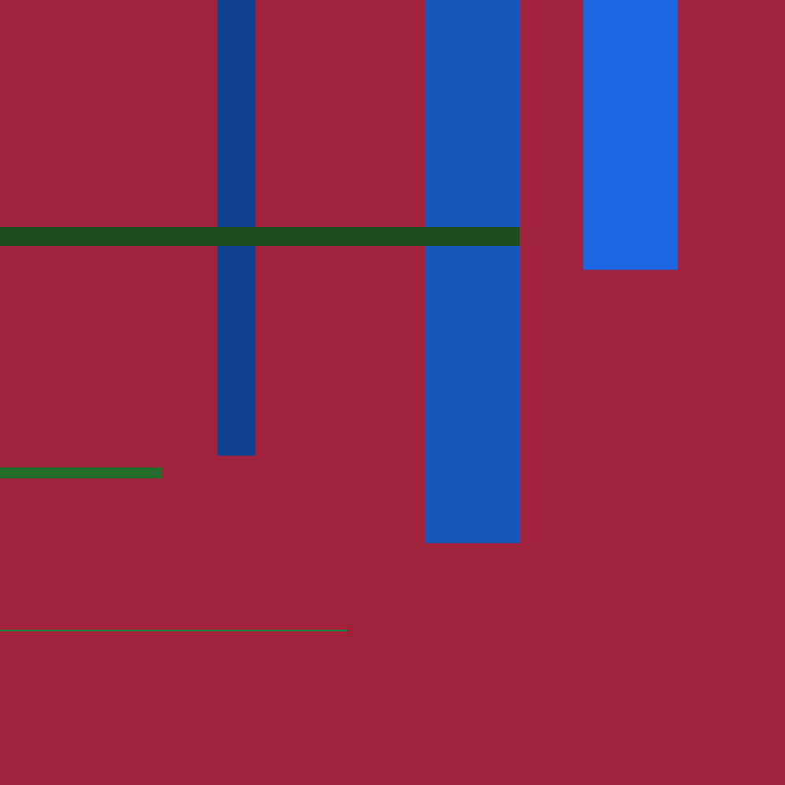

# Final Project

For this final clock, I evolved one of my time clocks to include date structure 
as well. When including 6 time variables, I wanted to keep it minimal, while 
still having the recognizable structure of plaid. The retinal variables I 
utilized were color, value, position, and size. I grouped the date times in 
green, the clock times in blues, and used lightness and darkness within the color 
to distingush between the times within each group with the longer times being 
darker values. For position, the lines progress either from top to bottom or from 
left to right with time and at the rate of each time variable. And finally size 
is determined by how "many" of that time there is in it's grouping -- example, 
24 hours, 12 months, 60 minutes, etc.