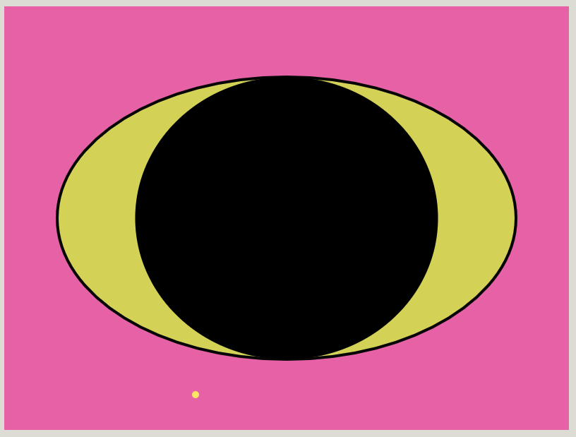
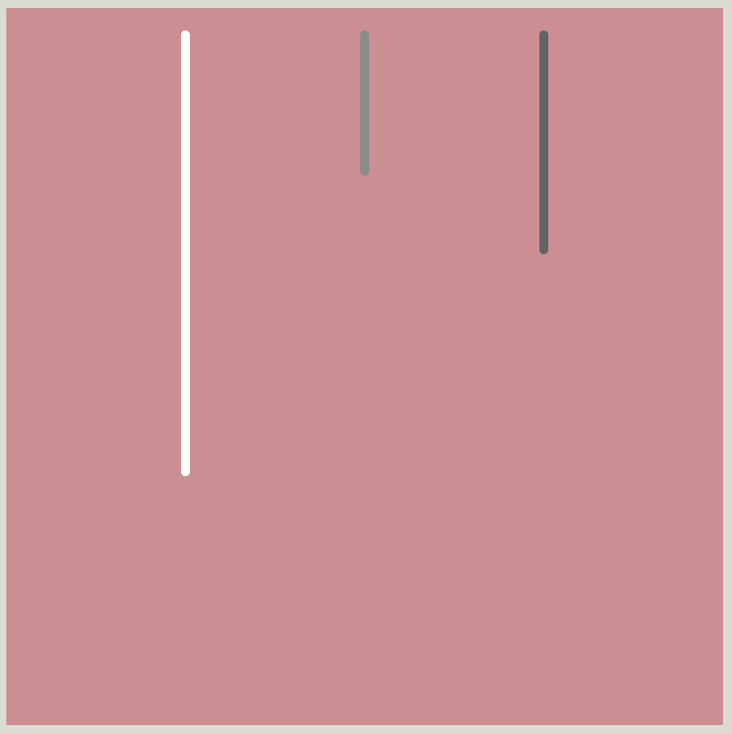

# Clocks demonstrating hour/minute/second

For this assignment, we are tasked with creating three abstract clocks using P5.js
For code details and comments, please review each project varient's sketch.js file.

Below are screenshots of each finished concept.

1. Cat Eye Clock:

2. Line Growth Clock:

3. Shapes Clock:

