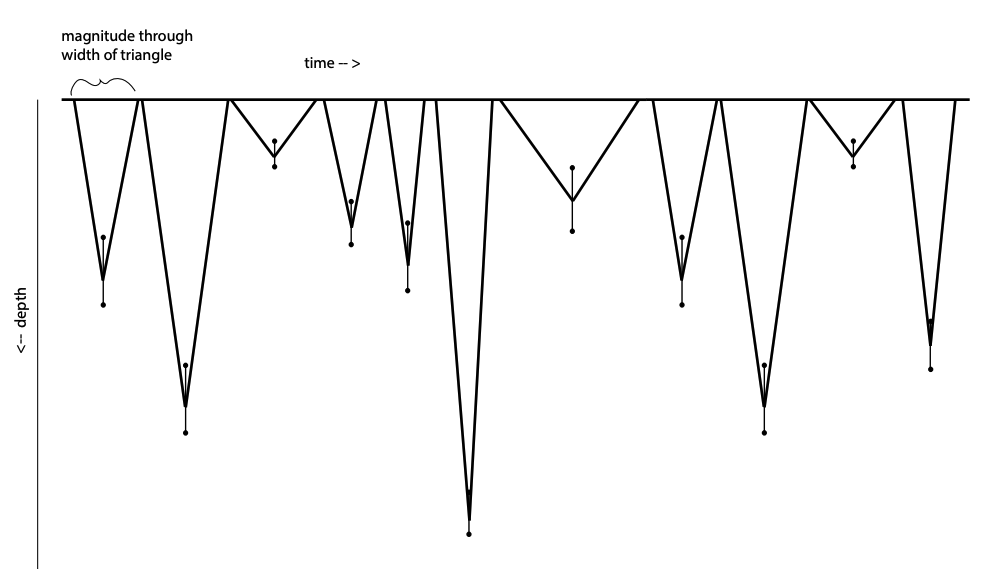
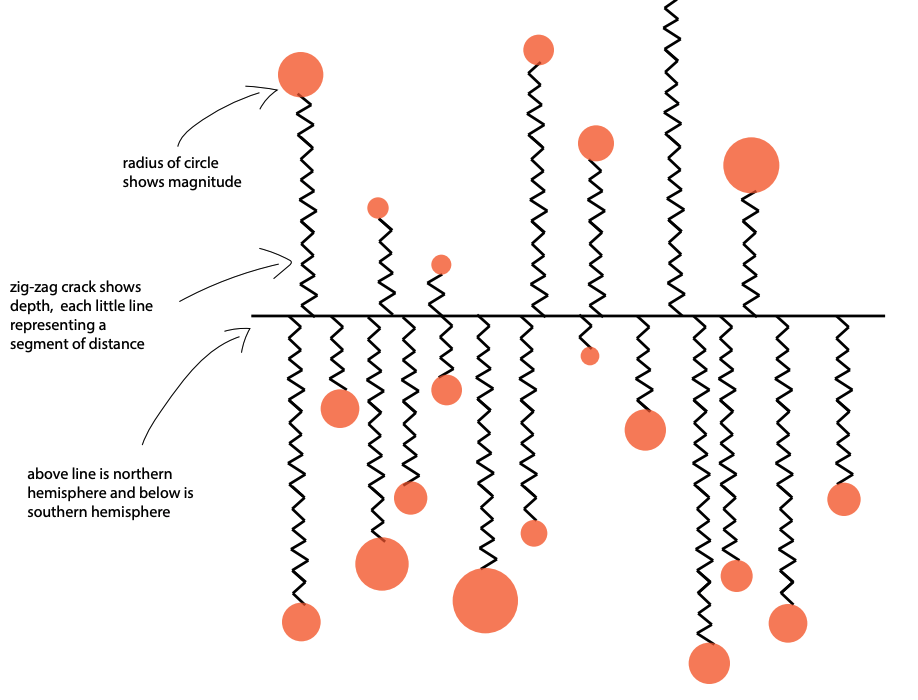
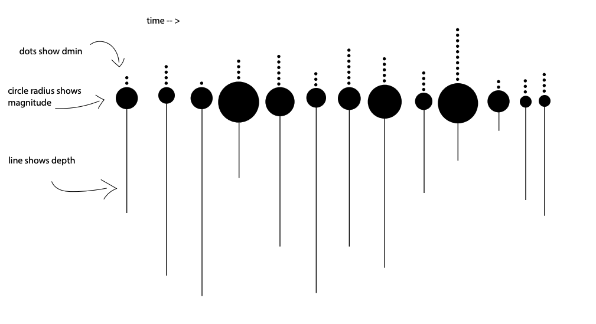
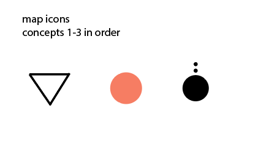

## Process

This folder contains sketches for the Stones Unturned project where I am looking 
at earthquake data and creating both a cartographic map and an additional second 
diagram.

I created 3 sketches of the diagrammatical visual that will ultimately be paired 
with a map made using Leaflet.js. 

Concept 1: 
For this concept I would use significan monthly values to show magnitude, and depth 
and display these values in a row over time. The width of the triangle base would 
demonstrate magnitude, while the length of the triangles vertically will show depth. 
I am including an error bar at the point to show depth error measurements. I'm 
hoping to convey cuts into the earth at different depths with this visual treatment.
The corresponding map marker would also be a triangle.

Concept 2:
This concept compares all-day data and separates earthquakes on the northern and 
southern hemispheres above and below the mid line. The zig-zag cracks show depth 
of the earthquakes, while the orange circles show magnitide through variation in 
radius size. The corresponding map marker would be the orange circle.

Concept 3:
This concept is looking at a new variable called dmin which shows the distance 
from the nearest recording station. This is shown with the small dots. The larger 
circles are showing magnitude through radius size, and the thin lines show depth 
of the earthquakes. For this visual, I'm using 3 years of significant monthly data 
and would have three rows of these symbols. On a map, I'd show one year at a time 
and the symbol would be the black magnitide cicle with the dots. 

Visual of the map icons:
