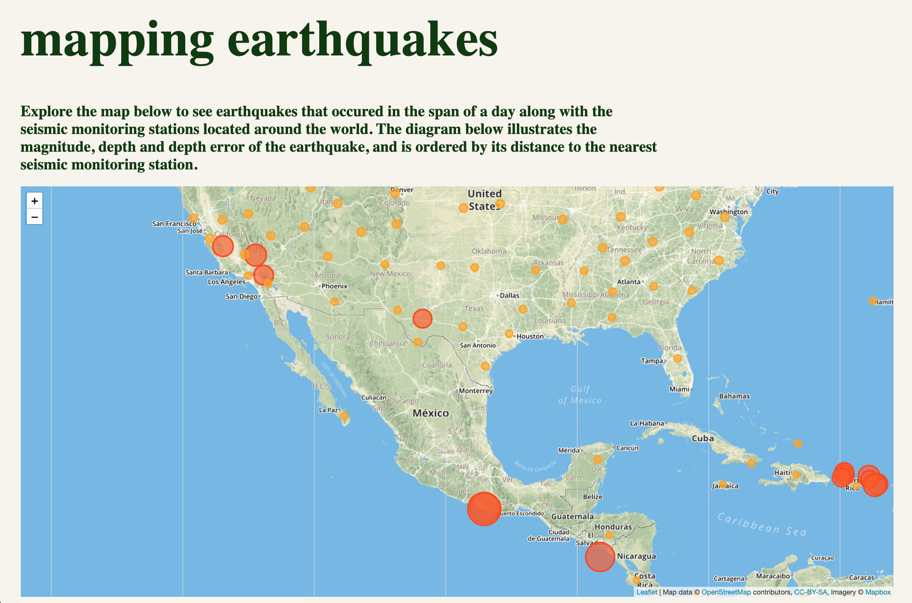
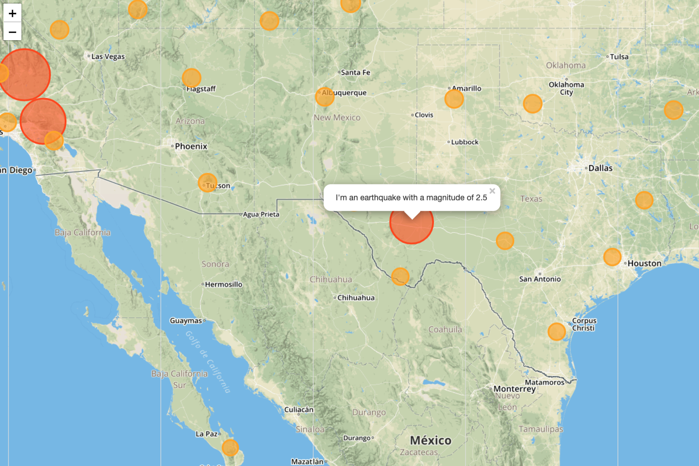
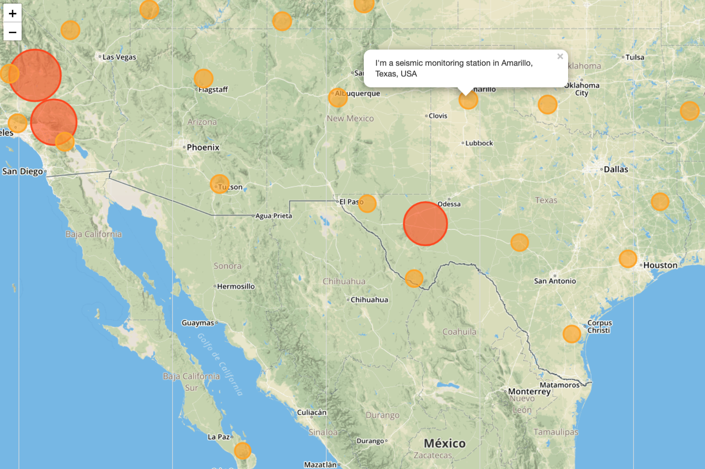
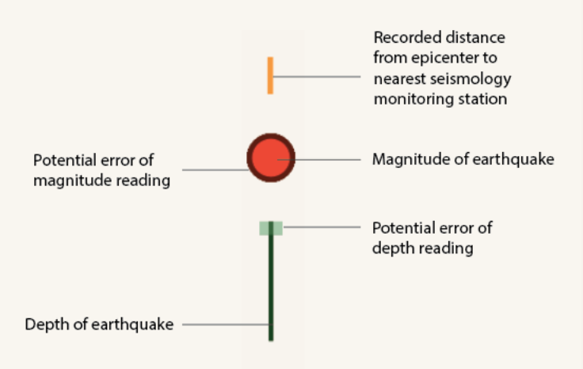
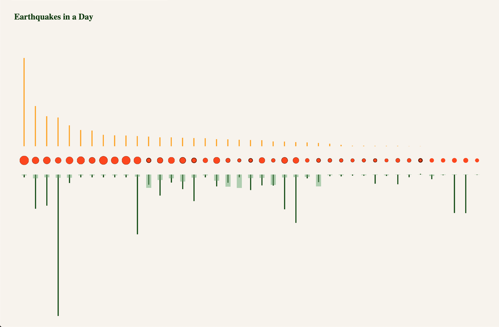

# DVIA Earthquakes
## Fall 2019

For this visualization, I am tasked with creating a visualization that combines 
data displayed on a map with data in a diagrammatical expression. I was most curious 
about the relationship of recording stations to the earthquakes themselves, and 
how that impacts the error readings in the data.

I chose to use the 2.5 week data because the number of readings fit the amount of 
data points I wanted to show in my diagram, and it also incorporates a range of 
magnitudes, unlike the purely significant tables. I am reading from a semi edited sheet, 
but only in order to enter "0" values in blank cells to avoid NaN errors. All other 
data is consistent with the live feed with no columns added or subtracted.

I used leaflet to plot the earthquakes and their magnitudes on the map from the provided 
data set. I brought in a dataset of seismic monitoring stations and their lat/long 
locations and plotted those on the map as well. The user can interact by panning, zooming, 
and selecting these points on the map to learn more about their locations or magnitude of the 
events. 

I created a diagrammatical view of the earthquakes showing many variables. To discern each 
element of information, the visual tools differ with color, position, and shape. I am displaying
magnitude, magnitude error, earthquake depth, depth error, and distance to the nearest station. 
I made a legend to help the viewer understand these symbols. The diagram is ordered by station 
distance, with the longest distance to a station on the far left and decreasing from there.

It does appear that some of the larger magnitude earthquake also have a further distance from a 
recording station. This could be because at least in this data set, more of the larger 
magnitude earthquakes are outside of the US and the majority of the recording stations are 
in the US.